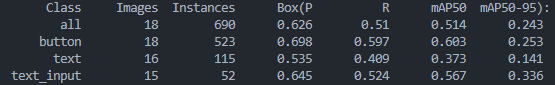
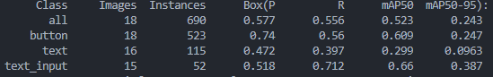
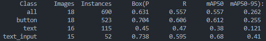
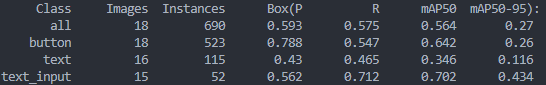
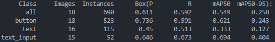
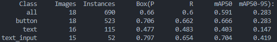

# Bro

**Bro** is an AI agent that autonomously interacts with the web. It takes a user-defined task, splits it into multiple subtasks to be run in parallel, which are assigned to other AI agents to complete. Bro navigates web pages using Chromium via Playwright, processes HTML, and repeatedly queries a language model (like `gpt-4o`) to decide the next action—until the task is completed.

## Features

- **Autonomous Web Navigation**: Uses Playwright to interact with web pages
- **Multi-Agent Architecture**: Splits tasks among specialized AI agents (CEO, Manager, Worker)
- **Computer Vision**: Integrates YOLO models for visual understanding
- **Parallel Task Execution**: Runs multiple subtasks simultaneously for efficiency
- **Flexible AI Backends**: Supports multiple language models (GPT, Claude, Cerebras)

## YOLO Model Performance

Bro integrates various YOLO models for computer vision tasks. Here's a comparison of different model sizes and their performance:

### YOLO v8 Models

*YOLO v8 Small - Fast inference, good for real-time applications*


*YOLO v8 Medium - Balanced performance and speed*

### YOLO v11 Models

*YOLO v11 Medium - Enhanced accuracy with improved architecture*


*YOLO v11 Large - High precision detection for complex scenarios*

### YOLO v12 Models

*YOLO v12 Medium - Latest improvements in detection accuracy*


*YOLO v12 Large - State-of-the-art performance for demanding applications*

## Installation

```bash
# Clone the repository
git clone <repository-url>
cd bro

# Install dependencies using uv
uv sync

# Install Playwright browsers
playwright install
```

## Usage

```python
from bro.main import Bro

# Initialize Bro with your task
bro = Bro("Search for the latest AI news and summarize the top 5 articles")

# Run the task
result = bro.run()
```

## Architecture

Bro uses a hierarchical multi-agent system:

- **CEO Agent**: High-level task planning and coordination
- **Manager Agent**: Subtask decomposition and resource allocation  
- **Worker Agents**: Individual task execution and web interaction

## Contributing

Please read our contributing guidelines and ensure all code follows the project's coding standards.

## License

[Add your license information here]


